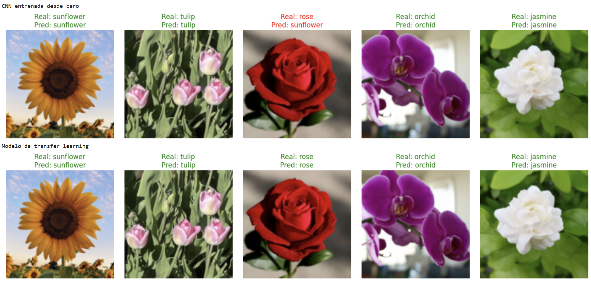

# 🌸 Flower Detection - IA
**`Deep Learning + AI for detection and clasification of different types of flowers`**

  

## 📌 Descripción
Este proyecto implementa un modelo de inteligencia artificial para la detección y clasificación de flores utilizando técnicas de aprendizaje automático y visión por computadora. Se desarrolla en **Google Colab** y está disponible en este repositorio.

## 📁 Estructura del Proyecto
- **IA_FlowerDetection.ipynb**: Notebook principal con el desarrollo del modelo.
- **data/**: Carpeta donde se almacenan las imágenes utilizadas para el entrenamiento y prueba.
- **models/**: Modelos entrenados guardados para su reutilización.

## 🛠️ Tecnologías Utilizadas
- Python
- TensorFlow / Keras
- OpenCV
- NumPy / Pandas / Matplotlib
- Google Colab

## 📦 Instalación y Uso
1. Clona el repositorio:
   ```sh
   git clone https://github.com/nicoferrey/FlowerDetection.git
   ```
2. Abre el notebook en Google Colab o Jupyter Notebook.
3. Ejecuta las celdas paso a paso para entrenar y probar el modelo.

## 🔍 Resultados
El modelo es capaz de clasificar diferentes tipos de flores con una precisión satisfactoria. Se incluyen ejemplos y visualizaciones de los resultados dentro del notebook.

## 🏗️ Mejoras Futuras
- Aumentar el dataset para mejorar la precisión.
- Implementar una interfaz gráfica para facilitar su uso.
- Optimizar el modelo para su uso en dispositivos móviles.
